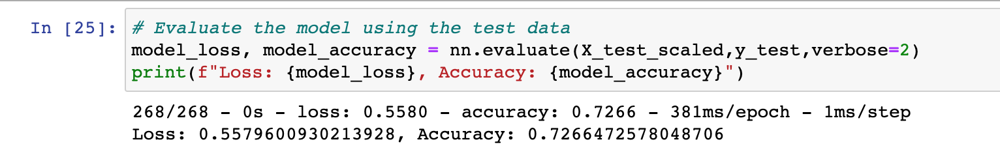
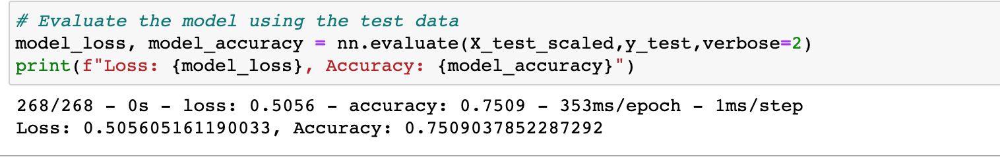

# AlphabetSoup Analysis

## Overview of the analysis

This project is to apply the machine learning and neural networks to predict whether applicants will be successful if funded by Alphabet Soup. More than 34,000 organizations that have received funding from Alphabet Soup over the years, Alphabet Soup has enough data to predict the outcome based on different parameters.

## Results 
### Data Preprocessing
#### What variable(s) are considered the target(s) for your model?
Target Variable: IS_SUCCESSFUL 

#### What variable(s) are considered to be the features for your model?
Feature Variables:
- APPLICATION_TYPE
- AFFILIATION
- CLASSIFICATION
- USE_CASE
- ORGANIZATION
- INCOME_AMT
- SPECIAL_CONSIDERATIONS

#### What variable(s) are neither targets nor features, and should be removed from the input data?
Variables neither target nor features and should be removed:
- EIN
- NAME

### Compiling, Training, and Evaluating the Model

#### How many neurons, layers, and activation functions did you select for your neural network model, and why?
My model had 2 hidden layers with activation function "relu":
- hidden_nodes_layer1 =  80 neurons
- hidden_nodes_layer2 = 30 neorons

My model had 1 output layer with activation function "sigmoid":

#### Were you able to achieve the target model performance?

We couldn't get accuracy above 0.75. It achieved accuracy of 0.7266.

#### What steps did you take to try and increase model performance?

After adding NAME back as one of the feature, the accuracy went above 0.75.

It achieved accuracy of 0.7509.

## Summary  

The right selection of features improves the accuracy of overall model. Adding name variable helped achieve accuracy over 0.75. The accuracy could go further higher if the model is trained by removing few variables or adding additional variables.

